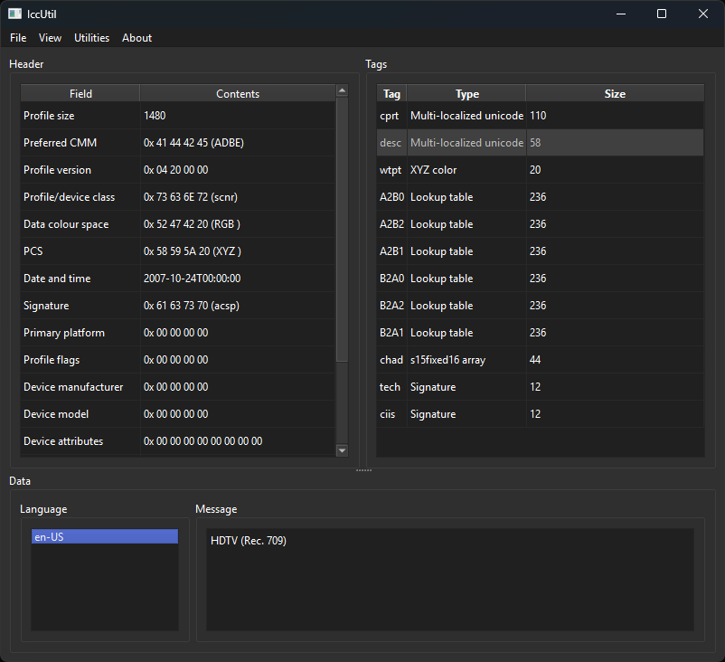
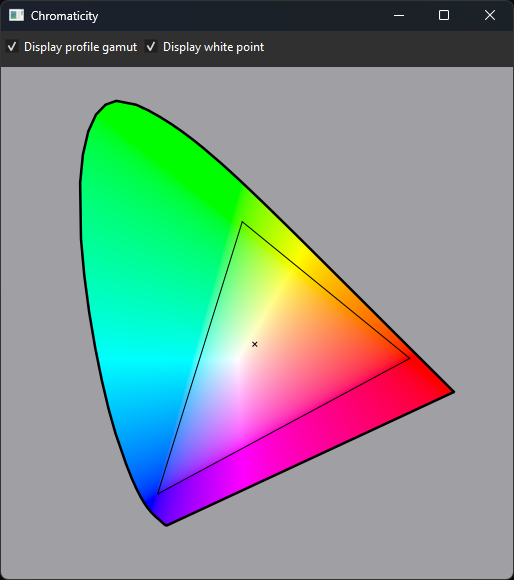

A simple utility to display properties of ICC color profile files.

Most of the color conversion math is copied from the [colour](https://github.com/colour-science/colour) python library.

IccUtil can display all of the information in an Icc v2 or v4 profile header as well as a list of all tags contained in the profile. The contents of some tags can be displayed, support for more tags is coming soon.

It can also create a chromaticity diagram with the loaded profile's gamut and white point marked.

